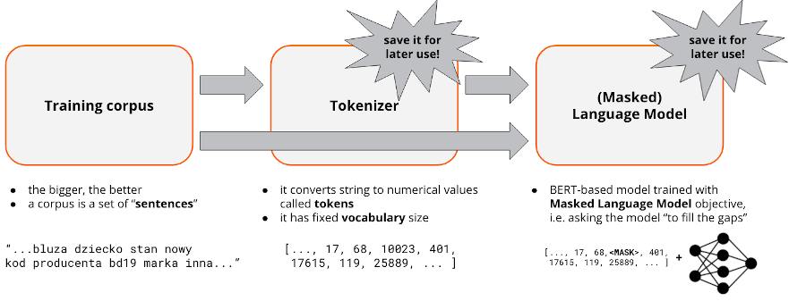
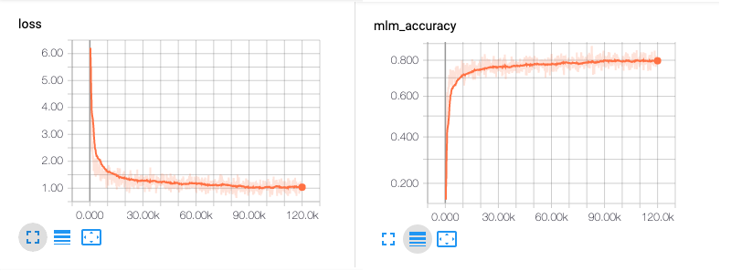

# Language Modeling Demo - ATM 2021

This repository has been created as auxiliary material for the presentation entitled 
_“Do You Speak Allegro?” Large Scale Language Modeling Using Allegro Offers Data_ held by Riccardo
Belluzzo during [Allegro Tech Meeting 2021](https://allegro.pl/zobacz/atm2021).
You can find the slides of the presentation here.

### Why Is This Repository Useful?

If you have followed the presentation, you may find this repository useful to better understand the
code presented. Otherwise, you may use this repository as the starting point for a project involving
Language Model training.

Language Models are the foundation of modern NLP systems. It has been proved that many state-of-the-art
results in NLP tasks like Text Classification, Summarization, Machine Translation have been achieved
by employing and fine-tuning Language Models pre-trained on big corpora of data.

In this repository, you will find the most compact code possible showing how you can train a BERT-based
Language Model on your domain-specific data. We have written this code using `🤗transformers` and 
`pytorch-lightning` two libraries known for being very intuitive and easy to use.


### Building Blocks of Language Model Training



In order to train a Language Model, you need:

1. A training corpus - namely, a big set of strings representing the "sentences" of the language you
want to fit. In the case your domain data were e-commerce users reviews, you could use each
review as a sentence.

2. A Tokenizer - an object converting strings to numbers (tokens)

3. A model - a neural network that will be trained following the Masked Language Model
objective, i.e trying to predict the masked token in a given sentence

In this repository we provide code for each of the aforementioned steps.

### Setup

Install the environment by running:

```bash
conda create env -f environment.yaml
```

this will install a conda environment called `lm-training-demo` into your working dir.
Activate it by running:

```bash
conda activate lm-training-demo
```

### Generate Training Corpus

Under the activated environment, run:

```bash
python ./corpus/run_corpus_generation.py
```

This will download and extract the [amazon_reviews_us](https://huggingface.co/datasets/amazon_us_reviews)
dataset to the specified `cache_dir`, process it and save it into the specified `output_dir`.
In particular, the corpus will be splitted into two sets (training and validation) of several `.txt` files.

Each .txt file should look like this: one sentence in each line.

```
- Britax Roundabout G4 Convertible Car Seat Onyx Prior Model
- Bebamour New Style Designer Sling and Baby Carrier 2 in 1
- Spry Kids Xylitol Tooth Gel 3 Pack Bubble Gum Original Strawberry Banana
- Graco Fastaction Fold Duo Click Connect Stroller
- JJ Cole Mode Diaper Tote Bag Mixed Leaf Discontinued by Manufacturer
- The creative energy saving mushroom energysaving lamps LED touch small night light the head of a bed bedroom lamp multi color
- Little Giraffe Luxe Solid Blanky
```

### Fit a Tokenizer

Under the activated environment, run:

```bash
python ./corpus/run_corpus_generation.py --corpus-dir path/to/training_corpus_dir
```

where `training_corpus_dir` is the training corpus generated at the previous point.
If the training will be successful you should see something like this:

```
[00:00:04] Pre-processing files (86 Mo)             ████████████████████████████████████████████████████████████████ 100%
[00:00:00] Tokenize words                           ████████████████████████████████████████████████████████████████ 40676    /    40676
[00:00:00] Count pairs                              ████████████████████████████████████████████████████████████████ 40676    /    40676
[00:00:00] Compute merges                           ████████████████████████████████████████████████████████████████ 29874    /    29874
```

and a file called `tokenizer.json` should be visible at the specified `output_dir`.

### Train a (Masked) Language Model

Under the activated environment, run:

```bash
python ./corpus/run_corpus_generation.py /
--job-dir path/to/job_dir
--path-to-train-set path/to/training_corpus
--path-to-val-set path/to/validation_corpus
--path-to-tokenizer path/to/tokenizer.json
```

this will train a `RoBERTa` solving the masked language model objective.
You can monitor the training through `tensorboard`:



